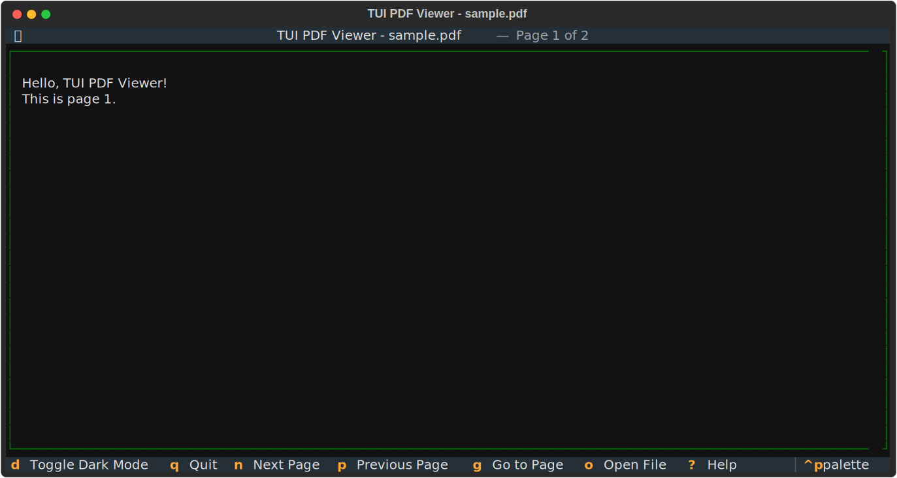

# TUI PDF Viewer


---

TextualとPyMuPDFを使用して構築した、ターミナル上で動作するPDFビューアーです。



## 特徴
- **テキスト表示**: PDFのテキストコンテンツを抽出してターミナル上で閲覧できます。
- **ページ移動**: キーボード操作でスムーズにページ送り・戻りが可能です。
- **ダークモード**: 目の疲れを軽減するダークモードに対応しています。

## 必要要件
- Python 3.8以上
- [uv](https://github.com/astral-sh/uv) (高速なPythonパッケージマネージャー)

## インストールとセットアップ

このプロジェクトは `uv` を使用して依存関係を管理しています。
リポジトリをクローンした後、以下のコマンドで環境をセットアップしてください。

```bash
# 依存関係の同期（仮想環境の作成とライブラリのインストール）
uv sync
```

## 使い方

PDFファイルのパスを引数に指定して起動します。

```bash
uv run -m tui_pdf_viewer.app <PDFファイルのパス>
```

例:
```bash
uv run -m tui_pdf_viewer.app sample.pdf
```

### キー操作一覧

| キー | 動作 |
| :---: | :--- |
| `n` | 次のページへ進む |
| `p` | 前のページに戻る |
| `d` | ダークモードの切り替え |
| `q` | アプリケーションを終了 |


---

## ライセンス

このプロジェクトは [MIT License](LICENSE) の下で公開しています。


---